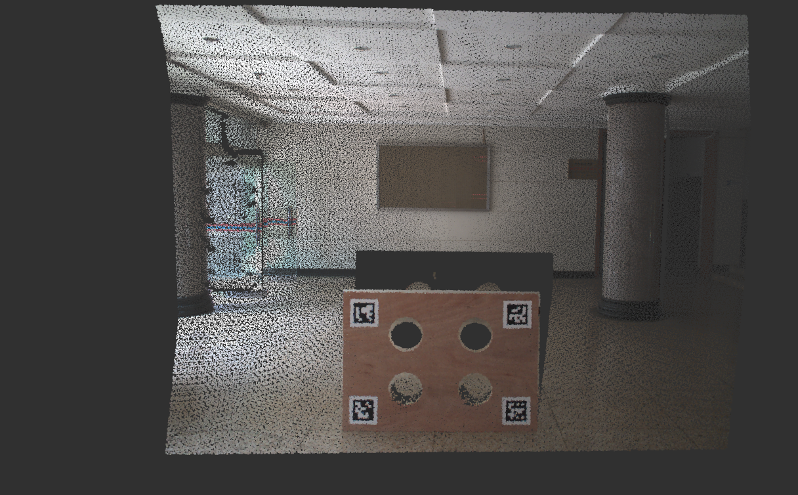

# CLM
a manual calibration tool for livox lidar and optical camera based on ros and reconfigure. Here is the video on [bilibili](https://www.bilibili.com/video/BV1XXQ3YoEyh/?spm_id_from=333.1007.top_right_bar_window_dynamic.content.click&vd_source=8497286ee613144d1e9b12e0bb103bd0
)

# usage example

## before calibration
the intial extrinsic is set to
$$\begin{bmatrix}
0&-1&0&0\\
0&0&-1&0\\
1&0&0&0\\
0&0&0&1\\
\end{bmatrix}$$

the clored point cloud before calibration is shown below:

## after calibration
first exect `roslaunch clm clm.launch` in a terminal
open rviz and add the topic /colored_cloud
by carefully adjust the parameters after exect `rqt` in the terminal, we can get the extrinsic from the first terminal.
and the colored lidar point cloud after calibration is shown below:

this is a simple HOWTO, please open an issue if you have any questions!!